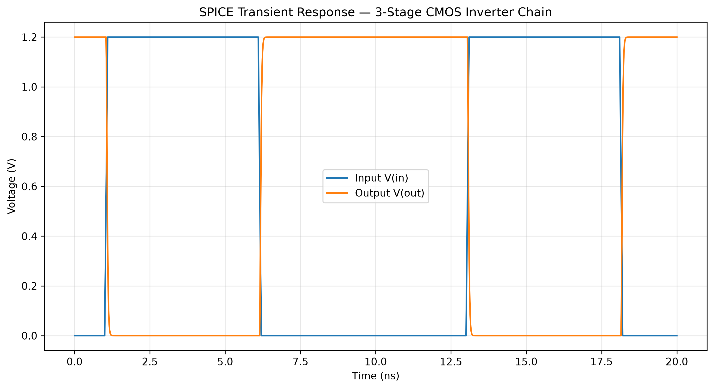

# AI-Based Surrogate Modeling for SPICE Simulation of CMOS Circuits

## Research Project

**Student:** Dashmesh Singh Chawla  
**Program:** Electronics Engineering — VLSI Design  
**Institution:** Thapar Institute of Engineering and Technology  
**Research Area:** AI for Circuit Simulation / SPICE Surrogate Modeling / VLSI

This project investigates whether a machine-learning surrogate model can learn the relationship between CMOS circuit design parameters and SPICE-simulated performance metrics.

The long-term objective is to reduce the computational cost of repeated SPICE simulations during circuit design-space exploration. SPICE remains the reference simulation engine, while the trained machine-learning model is investigated as a fast surrogate for repeated evaluations within the explored design space.

This is an active research prototype based on real `ngspice` simulations.

---

## 1. Research Question

**Can a machine-learning model trained on SPICE-generated data accurately predict the performance of a parameterized CMOS circuit while providing substantially faster evaluation than running a new SPICE simulation for every design point?**

The current study focuses on a three-stage CMOS inverter chain and predicts:

- `tpdhl` — high-to-low propagation delay
- `tpdlh` — low-to-high propagation delay
- `trise` — output rise time
- `tfall` — output fall time
- `avg_power_w` — average power

---

## 2. Circuit Under Study

The current experiment uses a three-stage CMOS inverter chain driven by a transient pulse input and connected to a capacitive output load.

The circuit is parameterized using five primary input variables:

| Parameter | Range | Description | Unit |
|---|---:|---|---|
| WN | 0.5–4.0 | NMOS width | um |
| WP | 1.0–8.0 | PMOS width | um |
| VDD | 0.9–1.8 | Supply voltage | V |
| CL | 10–200 | Output load capacitance | fF |
| VTO_SHIFT | -0.05–0.05 | Threshold-voltage shift | V |

The threshold-voltage shift is used to introduce variation in the operating conditions explored by the simulations.

The current implementation uses generic MOSFET models rather than a foundry-specific PDK.


## Example SPICE Transient Response

To establish the SPICE simulation as the reference or ground-truth response, a representative transient simulation was performed on the three-stage CMOS inverter chain.

The example simulation uses a 1.2 V supply, representative transistor dimensions, a fixed channel length, and a 50 fF output load. The transient analysis was performed over 20 ns with a maximum timestep of 10 ps.



The plot shows the applied input pulse and the corresponding output response of the three-stage inverter chain. The output waveform demonstrates the expected inversion behavior and finite transition time associated with the CMOS circuit.

These SPICE-generated transient responses form the reference data from which the machine-learning surrogate model is trained and evaluated.

---

## 3. Overall Methodology

The overall research workflow is:

```text
Circuit Design Parameters
          |
          v
     SPICE Simulation
          |
          v
   Performance Metrics
          |
          v
       Dataset
          |
          v
    Data Preparation
          |
          v
   Machine-Learning Model
          |
          v
 Prediction on Unseen Data
          |
          v
 Accuracy and Speed Evaluation
```

SPICE is treated as the reference or ground-truth simulation engine.

The machine-learning model is not intended to eliminate SPICE completely. Instead, the objective is to investigate whether it can act as a surrogate for repeated evaluations after sufficient SPICE data have been generated.

---

## 4. Dataset Generation

The dataset was generated using `ngspice` transient simulations.

The circuit parameters were varied across the defined design space and the resulting transient responses were processed to extract scalar performance metrics.

The current dataset contains:

| Quantity | Value |
|---|---:|
| Total samples | 1500 |
| Valid SPICE simulations | 1500 |
| Failed simulations | 0 |
| Input features | 5 |
| Prediction targets | 5 |

The main dataset is stored at:

```text
data/dataset.csv
```

Each dataset row contains circuit parameters, simulation results, and simulation-status information.

The primary columns are:

```text
WN
WP
VDD
CL
VTO_SHIFT
sample_id
tpdhl
tpdlh
trise
tfall
iavg
avg_power_w
sim_ok
```

---

## 5. Dataset Generation Code

The dataset-generation implementation is located at:

```text
code/generate_dataset.py
```

The script performs the following steps:

1. Generates circuit parameter combinations.
2. Creates the corresponding SPICE simulation.
3. Runs the transient simulation using `ngspice`.
4. Extracts timing and power metrics.
5. Stores the results in CSV format.

The generated dataset provides the reference data required for machine-learning training.

---

## 6. Data Preparation

The dataset is loaded using Pandas.

Rows are filtered using the `sim_ok` field and the required input and target columns are checked for valid values.

The five machine-learning input features are:

```text
WN
WP
VDD
CL
VTO_SHIFT
```

The five prediction targets are:

```text
tpdhl
tpdlh
trise
tfall
avg_power_w
```

The current dataset contains 1500 valid simulation samples.

For the propagation-delay targets, two samples contain non-positive values. These samples cannot be used for logarithmic regression because the logarithm of a non-positive value is undefined.

Therefore, the number of samples used for each target is:

| Target | Samples Used |
|---|---:|
| tpdhl | 1498 |
| tpdlh | 1498 |
| trise | 1500 |
| tfall | 1500 |
| avg_power_w | 1500 |

The dataset itself still contains 1500 successful simulations.

---

## 7. Machine-Learning Baseline

The first surrogate model selected for the project is a **Gradient Boosting Regressor**.

A separate regression model is trained for each target quantity.

The implementation is located at:

```text
code/train_baseline_model.py
```

The baseline configuration is:

| Parameter | Value |
|---|---:|
| Model | GradientBoostingRegressor |
| Number of estimators | 200 |
| Maximum depth | 3 |
| Learning rate | 0.1 |
| Random state | 0 |
| Test fraction | 20% |

The input features are standardized using `StandardScaler`.

The baseline workflow is:

```text
SPICE Dataset
      |
      v
Data Cleaning
      |
      v
Feature Selection
      |
      v
80/20 Train-Test Split
      |
      v
Feature Standardization
      |
      v
Log Transformation
      |
      v
Gradient Boosting Regression
      |
      v
Prediction
      |
      v
R2 / RMSE / MAE Evaluation
```

---

## 8. Log-Space Modeling

The targets are modeled in logarithmic space because the circuit-performance quantities are positive and can span a wide range.

The transformation is:

```text
y_log = log(y)
```

Predicted values are transformed back into their original units for RMSE and MAE evaluation.

The current implementation applies this transformation to all five positive target quantities.

A preliminary comparison showed that fitting timing quantities directly in raw seconds can perform substantially worse, while logarithmic modeling provides a much stronger regression relationship for the current dataset.

This behavior is treated as a research finding and will be investigated more rigorously in later experiments.

---

## 9. Baseline Results

The latest Gradient Boosting baseline was evaluated on a held-out test set.

| Target | R2 (log-space) | RMSE | MAE | Relative RMSE |
|---|---:|---:|---:|---:|
| tpdhl | 0.991945 | 3.953193e-11 | 2.027215e-11 | 13.54% |
| tpdlh | 0.988988 | 4.231690e-11 | 1.831914e-11 | 14.55% |
| trise | 0.994086 | 7.800899e-11 | 3.582475e-11 | 13.23% |
| tfall | 0.992201 | 5.854914e-11 | 3.122635e-11 | 10.87% |
| avg_power_w | 0.997590 | 6.885861e-07 | 4.975517e-07 | 3.41% |

The model achieves R2 values between approximately **0.9890 and 0.9976** across the five prediction targets.

The highest R2 is obtained for average power:

**R2 = 0.997590**

The lowest R2 is obtained for `tpdlh`:

**R2 = 0.988988**

These results indicate strong predictive performance within the explored design space.

The results are preliminary and require additional validation, model comparison, and generalization testing before stronger conclusions can be drawn.

---

## 10. Machine-Learning Inference Speed

The latest benchmark measured the machine-learning inference time for all five target models at:

```text
46.7 microseconds/sample
```

Using approximately 24 ms as the SPICE reference:

```text
SPICE = approximately 24 ms
ML    = approximately 46.7 microseconds
```

The approximate ratio is:

```text
24 ms / 46.7 microseconds = approximately 514
```

Therefore, the current benchmark suggests an evaluation-time advantage of approximately **500x** for the measured inference comparison.

This comparison must be interpreted carefully. The ML model requires an already-trained model, and the original SPICE simulations are required to generate the training dataset.

The comparison therefore represents the evaluation cost of an already-trained surrogate against running a new SPICE simulation.

A more rigorous benchmark will be performed in a later phase using repeated measurements and controlled conditions.

---

## 11. Prediction Plots

Prediction figures are stored in:

```text
results/figures/
```

Current actual-versus-predicted plots include:

```text
tpdhl_actual_vs_predicted.png
tpdlh_actual_vs_predicted.png
trise_actual_vs_predicted.png
tfall_actual_vs_predicted.png
avg_power_w_actual_vs_predicted.png
```

These plots compare SPICE reference values against Gradient Boosting predictions.

A prediction close to the ideal agreement relationship indicates stronger agreement between the surrogate and SPICE.

---

## 12. Feature Importance

Feature-importance analysis is implemented using:

```text
code/feature_importance.py
```

and visualized using:

```text
code/plot_feature_importance.py
```

The resulting figures are stored in:

```text
results/figures/
```

Current feature-importance plots include:

```text
tpdhl_feature_importance.png
tpdlh_feature_importance.png
trise_feature_importance.png
tfall_feature_importance.png
avg_power_w_feature_importance.png
```

Feature importance should be interpreted as model-based importance within the explored dataset rather than as direct proof of physical causality.

---

## 13. Result Files

Baseline metric table:

```text
results/baseline_results.csv
```

Held-out test predictions:

```text
results/test_predictions.csv
```

Complete SPICE dataset:

```text
data/dataset.csv
```

---

## 14. Project Structure

The current project structure is:

```text
AI-for-SPICE-Surrogate-Modeling/

├── README.md
│
├── code/
│   ├── generate_dataset.py
│   ├── train_baseline_model.py
│   ├── make_plots.py
│   ├── feature_importance.py
│   └── plot_feature_importance.py
│
├── data/
│   └── dataset.csv
│
├── documentation/
│   └── RESEARCH_PROGRESS_REPORT.md
│
└── results/
    ├── baseline_results.csv
    ├── test_predictions.csv
    └── figures/
        ├── avg_power_w_actual_vs_predicted.png
        ├── avg_power_w_feature_importance.png
        ├── tfall_actual_vs_predicted.png
        ├── tfall_feature_importance.png
        ├── tpdhl_actual_vs_predicted.png
        ├── tpdhl_feature_importance.png
        ├── tpdlh_actual_vs_predicted.png
        ├── tpdlh_feature_importance.png
        ├── trise_actual_vs_predicted.png
        └── trise_feature_importance.png
```

---

## 15. Reproducibility

Install the required Python packages:

```bash
pip install numpy pandas scipy scikit-learn
```

Install `ngspice` separately according to the operating system.

Generate a dataset using:

```bash
python3 code/generate_dataset.py --n-samples 1500
```

Train the baseline model using:

```bash
python3 code/train_baseline_model.py
```

The baseline results are saved to:

```text
results/baseline_results.csv
```

---

## 16. Current Research Status

The following components have been completed:

- Parameterized CMOS inverter-chain simulation
- Automated SPICE dataset generation
- 1500 valid simulation samples
- Dataset validation and preparation
- Gradient Boosting baseline model
- Log-space regression
- Held-out test evaluation
- R2 calculation
- RMSE calculation
- MAE calculation
- Relative RMSE calculation
- ML inference-speed measurement
- Actual-versus-predicted plots
- Feature-importance analysis
- Research progress documentation
- Git-based project version control

The project therefore currently provides a functioning end-to-end SPICE-to-machine-learning surrogate-model pipeline.

---

## 17. Limitations

### Generic transistor model

The simulations use generic MOSFET models rather than a foundry-specific PDK.

Therefore, the current results demonstrate the machine-learning methodology rather than production-level predictions for a specific semiconductor technology.

### Single circuit topology

The current study uses one three-stage CMOS inverter chain.

Generalization to different circuit topologies has not yet been demonstrated.

### Fixed channel length

Channel length is currently held fixed.

Only five circuit parameters are varied:

```text
WN
WP
VDD
CL
VTO_SHIFT
```

### Limited dataset size

The current dataset contains 1500 simulations.

Larger datasets are required to determine how surrogate accuracy scales with training-data size.

### Scalar prediction

The current baseline predicts five scalar performance metrics.

It does not yet reproduce the complete transient waveform.

---

## 18. Planned Research Work

### Phase 1 — Rigorous Error Analysis

- Calculate RMSE and MAE consistently for all targets.
- Analyze relative prediction error.
- Identify maximum-error samples.
- Identify worst-performing design points.
- Generate error-distribution plots.
- Perform a controlled SPICE-versus-ML timing benchmark.

### Phase 2 — Machine-Learning Model Comparison

Compare Gradient Boosting against additional regression models such as:

- Random Forest
- XGBoost or another boosting approach
- Other suitable regression models

Compare models using:

- R2
- RMSE
- MAE
- inference time

### Phase 3 — Dataset Scaling

Investigate model performance as the number of SPICE-generated training samples increases.

Potential dataset sizes:

```text
500
1000
1500
3000
5000
```

The objective is to determine the relationship between training-data size and surrogate accuracy.

### Phase 4 — Generalization Testing

Evaluate the trained model on previously unseen parameter combinations, with particular attention to:

- design-space boundaries
- combinations between sampled points
- regions with strong nonlinear behavior
- operating conditions near threshold-voltage variation limits

### Phase 5 — Generalization to Other Circuits

Evaluate a second circuit family, such as:

- a longer inverter chain
- another CMOS logic circuit
- a simple differential pair

This would provide a stronger test of whether the methodology generalizes beyond a single topology.

### Phase 6 — Waveform-Level Surrogate Modeling

A more advanced stage will investigate prediction of the complete transient waveform rather than only scalar metrics.

The target workflow is:

```text
Circuit Parameters
        |
        v
Machine-Learning Model
        |
        v
Predicted v(out,t)
        |
        v
Comparison with SPICE waveform
```

This is intended to move the project toward a more complete surrogate for SPICE transient simulation.

---

## 19. Research Significance

The motivation for this work is the computational cost of repeated circuit simulation during design-space exploration.

Traditional circuit-design workflows may require many SPICE simulations to evaluate different combinations of:

- transistor dimensions
- supply voltage
- capacitive loading
- process variations
- circuit configurations

A trained surrogate model may provide rapid approximate evaluations once sufficient SPICE-generated training data are available.

The research therefore investigates the trade-off between:

```text
SPICE Simulation
       |
       v
Training Dataset
       |
       v
Machine-Learning Surrogate
       |
       v
Fast Prediction
```

The central question is whether the computational cost of generating the training data can be justified by the reduction in cost during repeated subsequent evaluations.

---

## 20. Interpretation of Current Results

The current R2 values demonstrate strong predictive performance within the explored design space.

They do not yet prove that the model can replace SPICE for arbitrary CMOS circuits.

The following remain to be investigated:

- generalization beyond the current topology
- extrapolation outside the training distribution
- performance with larger datasets
- robustness to different circuit configurations
- waveform-level prediction
- comparison with alternative ML models
- rigorous end-to-end computational-cost analysis

The current work should therefore be described as a:

**baseline surrogate-modeling study and research prototype**

rather than a complete replacement for SPICE.

---

## 21. Conclusion

The current project demonstrates a complete initial workflow for AI-based surrogate modeling of SPICE circuit simulations.

A dataset of 1500 valid SPICE simulations was generated for a parameterized three-stage CMOS inverter chain.

A Gradient Boosting regression model was trained to predict five SPICE-derived performance metrics:

- `tpdhl`
- `tpdlh`
- `trise`
- `tfall`
- `avg_power_w`

The baseline achieves R2 values from **0.988988 to 0.997590** across the five target quantities.

The measured ML inference time is approximately:

**46.7 microseconds/sample**

for all five target predictions.

Using the current approximately 24 ms SPICE reference time, this corresponds to an approximate evaluation-time ratio of **514x**.

These results provide evidence that a machine-learning surrogate can reproduce important SPICE-derived scalar performance metrics with high accuracy within the investigated design space while providing substantially faster inference than a new SPICE simulation.

These findings remain preliminary. Further work is required in error analysis, controlled timing benchmarks, model comparison, dataset scaling, generalization testing, and waveform-level surrogate modeling.

---

## 22. Author

**Dashmesh Singh Chawla**

Electronics Engineering — VLSI Design

Thapar Institute of Engineering and Technology

Research Area:

**AI for Circuit Simulation / SPICE Surrogate Modeling / VLSI**
