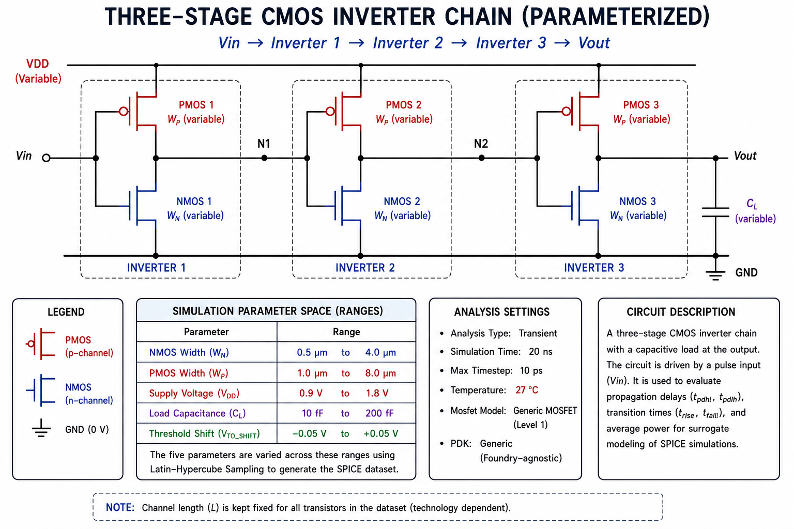
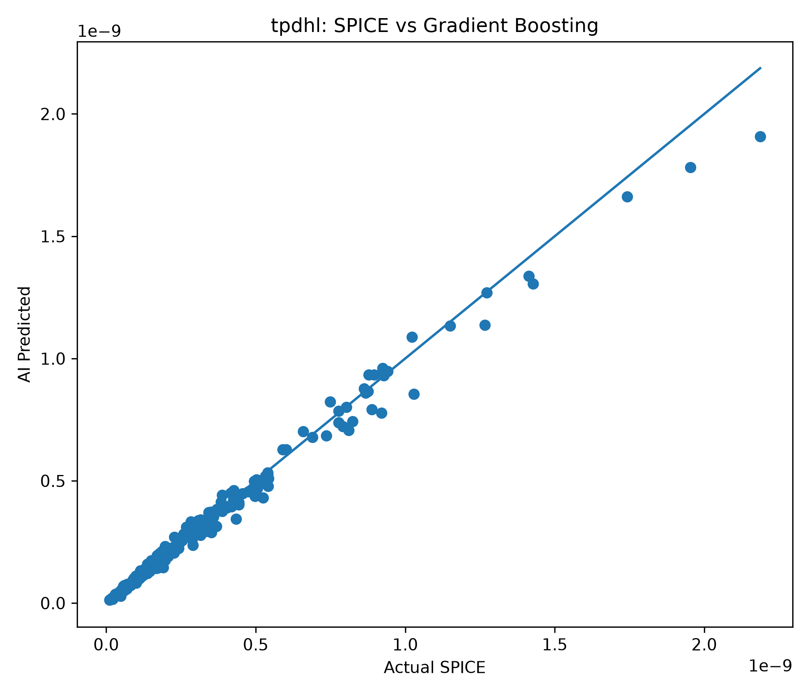
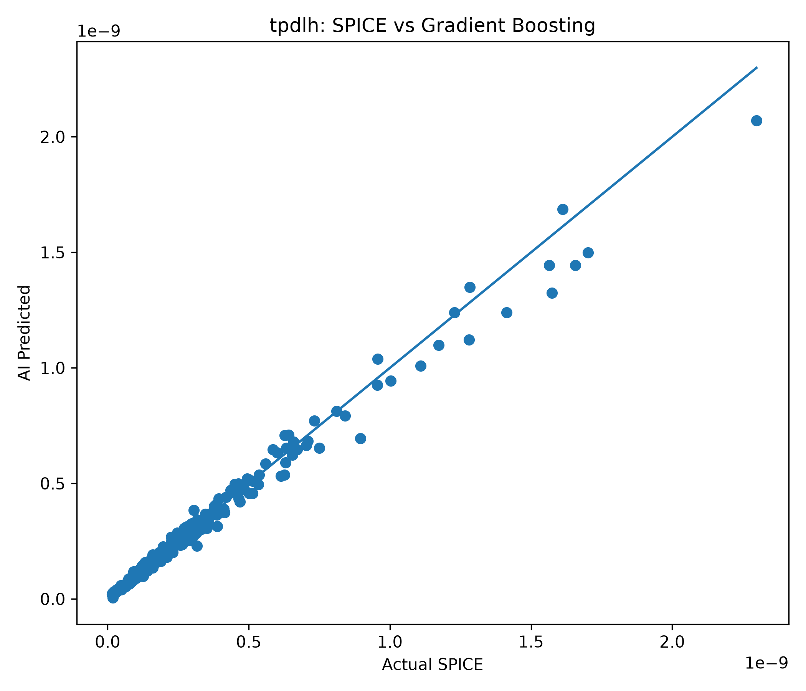
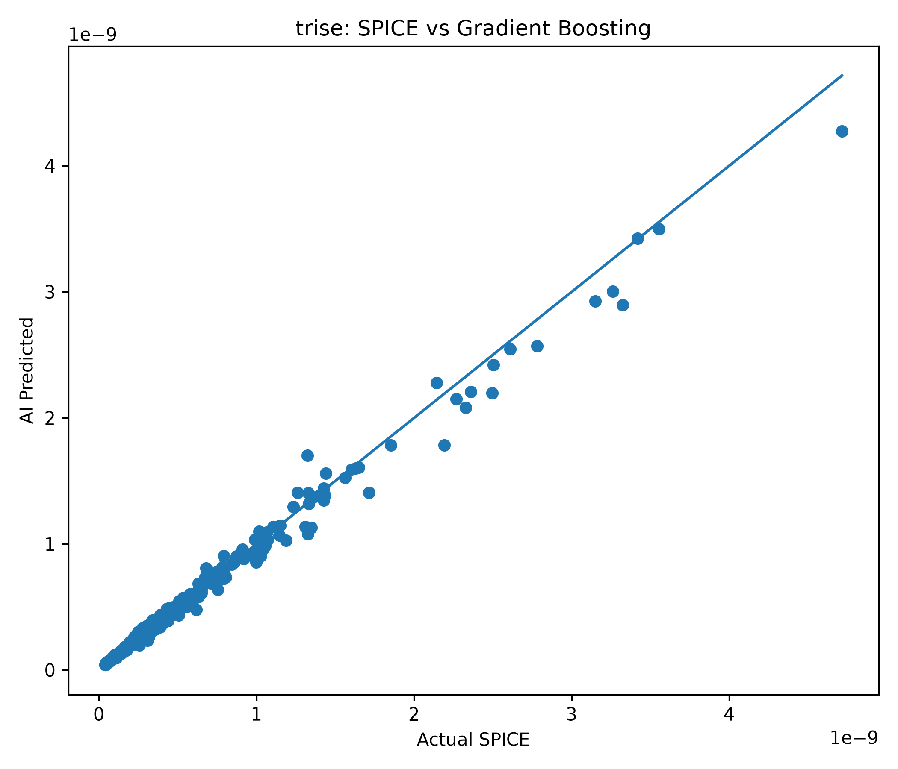
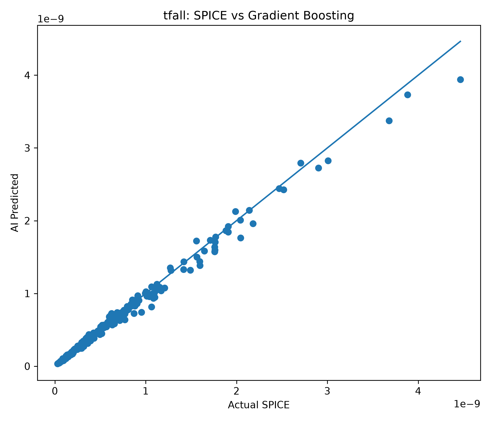
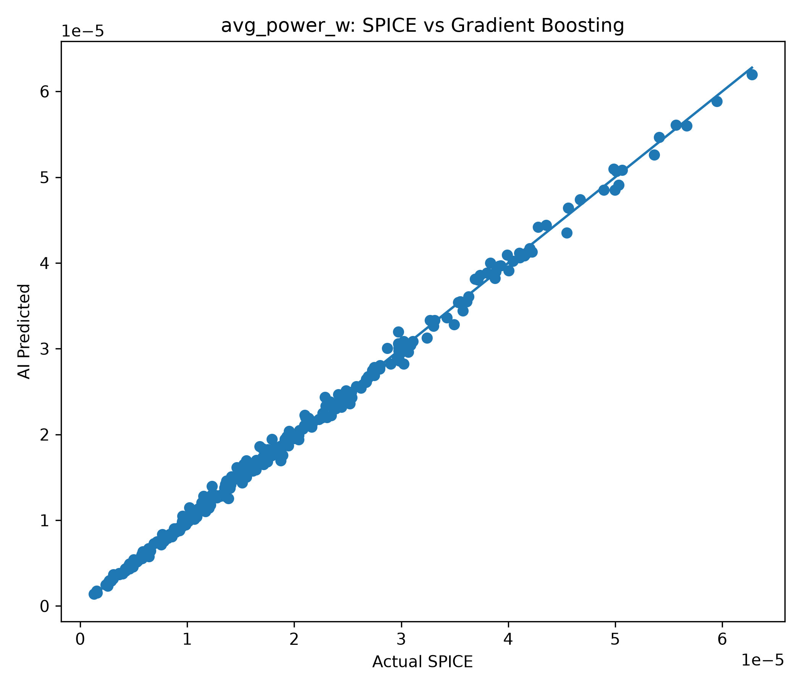
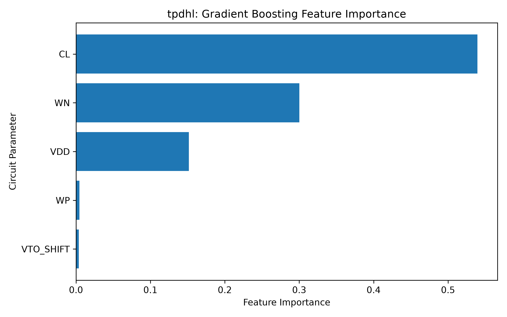
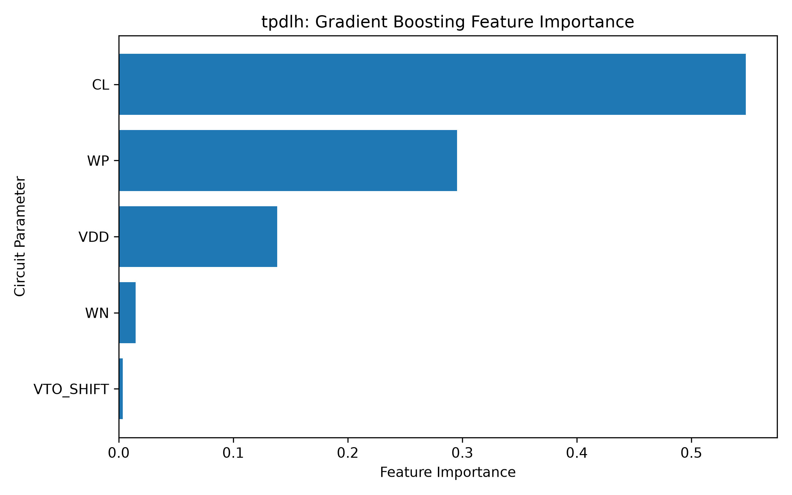
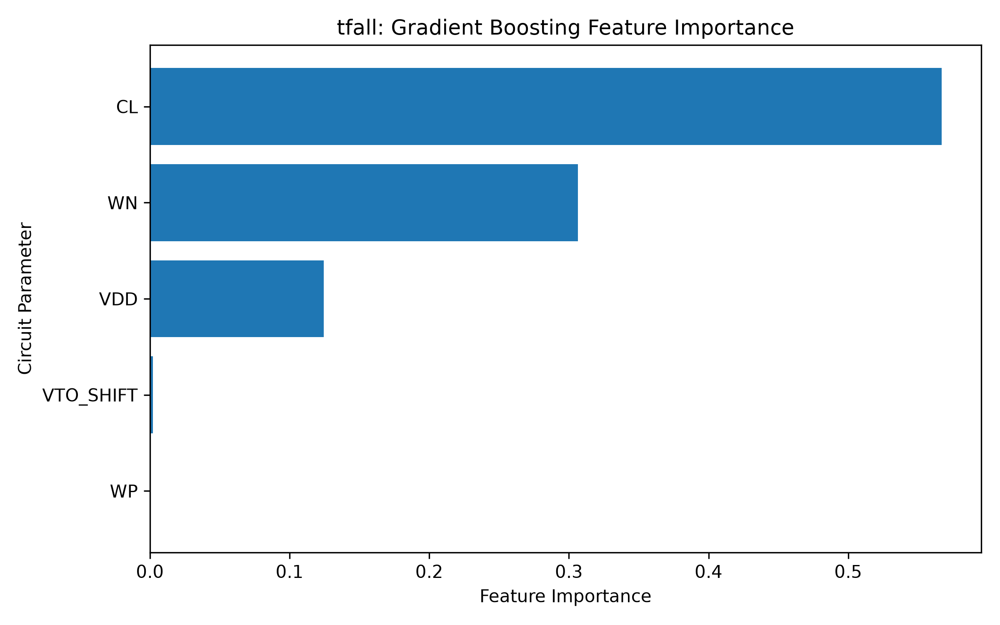
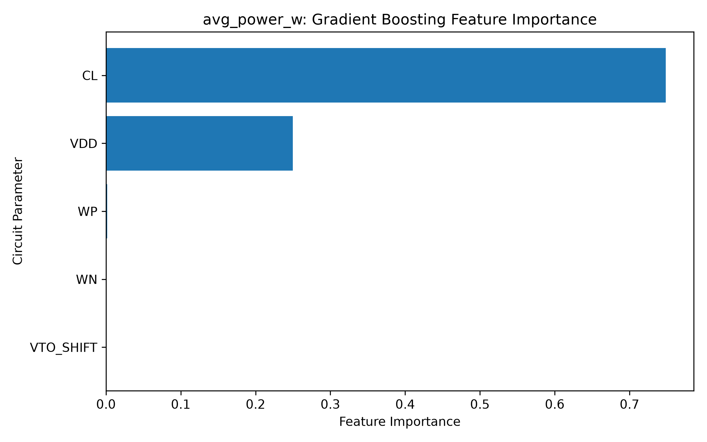

# AI-Based Surrogate Modeling for SPICE Simulation of CMOS Circuits

<p align="center">
  <strong>AI for Circuit Simulation • SPICE Surrogate Modeling • VLSI</strong>
</p>

<p align="center">
  <em>A machine-learning approach to accelerating repeated CMOS circuit evaluation.</em>
</p>

---

## Research Overview

**Author:** Dashmesh Singh Chawla  
**Program:** Electronics Engineering — VLSI Design  
**Institution:** Thapar Institute of Engineering and Technology

### Research Question

Can a machine-learning model trained on SPICE-generated data accurately predict the performance of a parameterized CMOS circuit while being substantially faster to evaluate than a new SPICE simulation?

This work presents an initial baseline study using a **three-stage CMOS inverter chain**. Real `ngspice` simulations are used to generate the dataset, and a Gradient Boosting model is trained to predict five circuit-level performance metrics.

### Current Results

| Metric | Result |
|---|---:|
| SPICE simulations | **1500** |
| Input parameters | **5** |
| Predicted quantities | **5** |
| Best R² | **0.997590** |
| Lowest R² | **0.988988** |
| ML inference time | **46.7 μs/sample** |
| SPICE reference time | **~24 ms/sample** |
| Evaluation-time ratio | **~514×** |

> **Current status:** The SPICE-to-ML baseline is complete. The next stage will focus on error analysis, model comparison, dataset scaling, generalization, and waveform-level prediction.

---

# 1. Circuit Under Study

The circuit used in the current experiment is a three-stage CMOS inverter chain driven by a transient pulse and connected to a capacitive output load.

Five parameters are varied during dataset generation:

| Parameter | Range | Description |
|---|---:|---|
| `WN` | 0.5–4.0 μm | NMOS width |
| `WP` | 1.0–8.0 μm | PMOS width |
| `VDD` | 0.9–1.8 V | Supply voltage |
| `CL` | 10–200 fF | Output load capacitance |
| `VTO_SHIFT` | −0.05–0.05 V | Threshold-voltage shift |

The channel length is held fixed. The current implementation uses generic MOSFET models rather than a foundry-specific PDK, so the purpose of the experiment is to study the surrogate-modeling methodology rather than make process-specific device predictions.

### Circuit Schematic



### Representative SPICE Transient Response

A representative transient simulation was used to establish the SPICE response against which the surrogate is evaluated. The transient analysis covers 20 ns with a maximum timestep of 10 ps.


---

# 2. Methodology

The workflow used in this study is intentionally straightforward:

```text
Circuit Parameters
       ↓
ngspice Transient Simulation
       ↓
Performance Metric Extraction
       ↓
SPICE Dataset
       ↓
Data Preparation
       ↓
Gradient Boosting Surrogate
       ↓
Held-Out Test Evaluation
```

The five input features are:

`WN`, `WP`, `VDD`, `CL`, and `VTO_SHIFT`.

The five predicted quantities are:

`tpdhl`, `tpdlh`, `trise`, `tfall`, and `avg_power_w`.

The dataset contains **1500 successful simulations**. Two samples contain non-positive values for each propagation-delay target and are therefore excluded from the corresponding log-space regression, since `log(y)` is undefined for non-positive values.

The baseline uses an 80/20 train-test split and a Gradient Boosting Regressor with 200 estimators, maximum depth 3, learning rate 0.1, and random state 0.

---

# 3. Log-Space Modeling

One of the useful observations from the baseline experiment was the effect of modeling the timing quantities in logarithmic space.

The timing targets are modeled as:

```text
y_log = log(y)
```

and converted back to their original units for RMSE and MAE calculation.

Direct modeling in raw seconds performed substantially worse in the preliminary comparison, while log-space modeling produced a much stronger regression relationship on the current dataset.

This is an important result for the project because the timing quantities span a relatively wide numerical range and are strongly nonlinear with respect to the circuit parameters.

---

# 4. Results

The Gradient Boosting baseline was evaluated on a held-out test set.

| Target | R² | RMSE | MAE | Relative RMSE |
|---|---:|---:|---:|---:|
| `tpdhl` | **0.991945** | 3.953193e-11 | 2.027215e-11 | 13.54% |
| `tpdlh` | **0.988988** | 4.231690e-11 | 1.831914e-11 | 14.55% |
| `trise` | **0.994086** | 7.800899e-11 | 3.582475e-11 | 13.23% |
| `tfall` | **0.992201** | 5.854914e-11 | 3.122635e-11 | 10.87% |
| `avg_power_w` | **0.997590** | 6.885861e-07 | 4.975517e-07 | 3.41% |

The model achieved R² values between **0.988988 and 0.997590** across all five targets. Average power was the most accurately predicted quantity, while `tpdlh` had the lowest R².

These results indicate that the model captures the relationship between the sampled circuit parameters and the SPICE-derived scalar metrics well within the investigated design space.

## SPICE vs. ML Predictions

The following plots compare SPICE reference values with predictions from the trained Gradient Boosting models.

### Propagation Delay — tpdhl



### Propagation Delay — tpdlh



### Rise Time — trise



### Fall Time — tfall



### Average Power



---

# 5. Feature Importance

Feature importance was examined to understand which of the five input parameters contributed most strongly to each trained model.

These values describe the behavior of the machine-learning model within the sampled dataset; they should not be interpreted as direct proof of physical causality.

### tpdhl



### tpdlh



### trise


### tfall



### Average Power



---

# 6. Inference Speed

The measured inference time for predicting all five quantities was approximately:

**46.7 μs per sample**

The corresponding SPICE reference time was approximately:

**24 ms per simulation**

This gives:

```text
24 ms / 46.7 μs ≈ 514
```

or approximately a **514× evaluation-time ratio** for the current benchmark.

This number should be interpreted as the cost of evaluating an already-trained surrogate versus running a new SPICE simulation. It does not include the cost of generating the original SPICE dataset or training the machine-learning model.

---

# 7. Limitations and Next Steps

The current experiment is a baseline rather than a complete SPICE replacement.

### Limitations

- Only one circuit topology has been studied.
- The MOSFET models are generic rather than from a foundry PDK.
- Channel length is held fixed.
- The current dataset contains 1500 simulations.
- The baseline predicts scalar metrics rather than the complete transient waveform.
- Generalization outside the sampled design space has not yet been established.

### Next Research Steps

**1. Error analysis**  
Investigate maximum-error samples, error distributions, relative error, and controlled SPICE-versus-ML timing measurements.

**2. Model comparison**  
Compare Gradient Boosting with Random Forest, XGBoost, and other suitable regression approaches.

**3. Dataset scaling**  
Evaluate model performance as the dataset grows from approximately 500 to 5000 simulations.

**4. Generalization**  
Test unseen parameter combinations, particularly near design-space boundaries and nonlinear regions.

**5. Additional circuits**  
Evaluate whether the approach transfers to another circuit topology.

**6. Waveform-level surrogate**  
Move beyond five scalar outputs and predict the complete transient `v(out,t)` waveform.

The waveform-level model is the longer-term goal because it would provide a closer approximation to the actual transient behavior produced by SPICE.

---

# 8. Reproducibility

Install the Python dependencies:

```bash
pip install numpy pandas scipy scikit-learn
```

Install `ngspice` separately.

Generate the dataset:

```bash
python3 code/generate_dataset.py --n-samples 1500
```

Train the baseline:

```bash
python3 code/train_baseline_model.py
```

Main result files:

```text
data/dataset.csv
results/baseline_results.csv
results/test_predictions.csv
results/figures/
```

---

# 9. Conclusion

This study establishes a working baseline for AI-based surrogate modeling of SPICE simulations.

Using 1500 successful `ngspice` simulations of a parameterized three-stage CMOS inverter chain, a Gradient Boosting model was trained to predict propagation delay, rise time, fall time, and average power.

The baseline achieved R² values from **0.988988 to 0.997590**. The trained surrogate required approximately **46.7 μs per sample** to predict all five quantities, compared with an approximately **24 ms** SPICE reference evaluation.

The results suggest that machine-learning surrogates can reproduce important SPICE-derived scalar metrics with high accuracy within the current design space while providing much faster evaluation.

The main question for the next stage is whether this behavior remains reliable with more training data, different circuit topologies, and eventually complete transient waveform prediction.

---

## Project Structure

```text
AI-for-SPICE-Surrogate-Modeling/

├── README.md
├── code/
│   ├── generate_dataset.py
│   ├── train_baseline_model.py
│   ├── make_plots.py
│   ├── feature_importance.py
│   └── plot_feature_importance.py
├── data/
│   └── dataset.csv
├── documentation/
│   └── RESEARCH_PROGRESS_REPORT.md
└── results/
    ├── baseline_results.csv
    ├── test_predictions.csv
    └── figures/
```

---

**Dashmesh Singh Chawla**  
Electronics Engineering — VLSI Design  
Thapar Institute of Engineering and Technology

*AI for Circuit Simulation / SPICE Surrogate Modeling / VLSI*